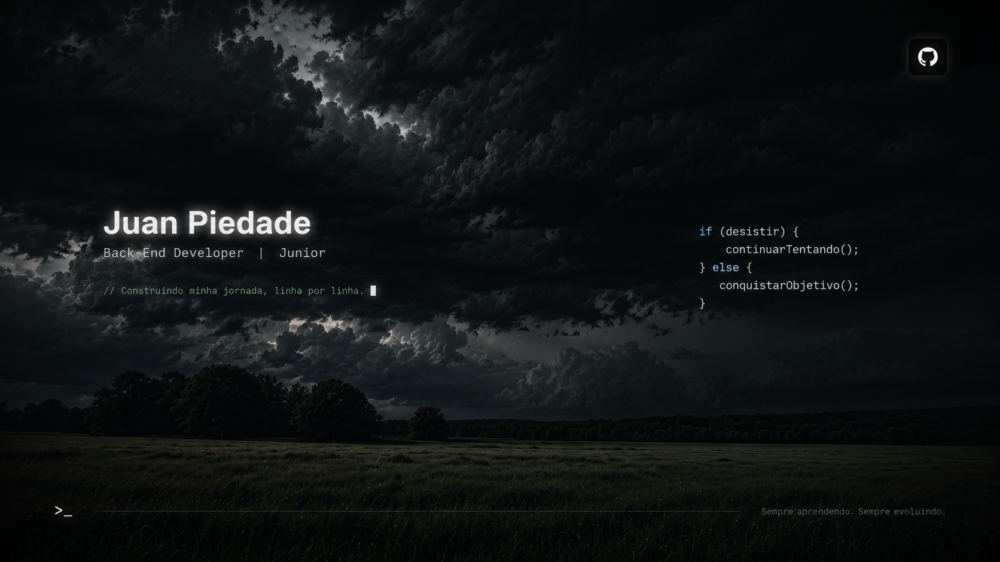

<h1 align="center">Olá mundo!👋​</h1>

### 💫​ Sobre mim

Me chamo Juan Piedade, tenho 19 anos e sou da Bahia, de Alcobaça. Atualmente moro no Espírito Santo. Concluí o ensino médio e estou cursando na área de programação, motivado pela minha paixão por tecnologia.

<a href="https://www.linkedin.com/in/juanpiedade/" target="_blank">

<h4 align="center">🤖 Linguagens e Ferramentas</h4>

---

  
  
  
  
  
  
  
  
  
  
  
  
  
  
  
  
  
  

###